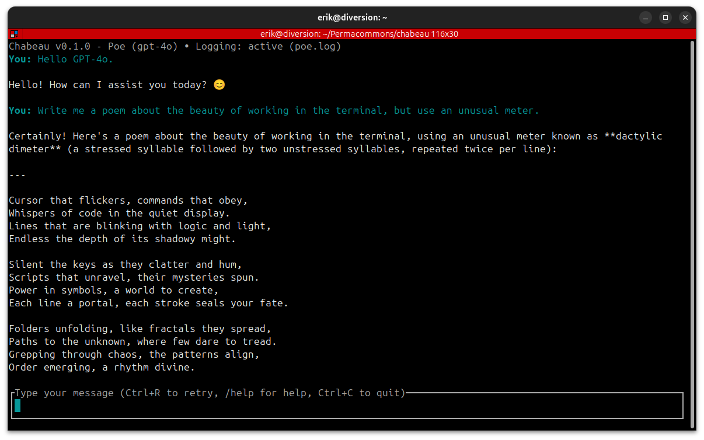

# Chabeau - Terminal Chat Interface



**NOTE:** This is pre-alpha software. It has only been tested on Linux.

A full-screen terminal chat interface that connects to various AI APIs for real-time conversations with secure credential management.

Chabeau is not a coding agent, nor does it aspire to be one. Instead, it brings the conveniences of web-based chat UIs to the terminal, with your favorite editor for long prompts.


## Features

- Full-screen terminal UI with real-time streaming responses
- Multiple OpenAI-compatible providers (OpenAI, OpenRouter, Poe, custom)
- Secure API key storage in system keyring
- Message retry and external editor support
- Conversation logging with pause/resume

## Quick Start

### Installation
```bash
cargo install chabeau
```

### Setup Authentication
```bash
chabeau auth    # Interactive setup for OpenAI, OpenRouter, Poe, or custom providers
```

### Start Chatting
```bash
chabeau         # Uses default provider and model (gpt-4o)
```

## Usage

### Basic Commands
```bash
chabeau                              # Start chat with defaults
chabeau --provider openai            # Use specific provider
chabeau --model gpt-3.5-turbo        # Use specific model
chabeau --log conversation.log       # Enable logging
```

### Discovery
```bash
chabeau -p                           # List providers and auth status
chabeau -m                           # List available models
chabeau -p openrouter -m             # List models for specific provider
```

### Authentication Management
```bash
chabeau auth                         # Set up authentication
chabeau deauth                       # Remove authentication (interactive)
chabeau deauth --provider openai     # Remove specific provider
```

### Environment Variables (Fallback)
If no authentication is configured:
```bash
export OPENAI_API_KEY="your-api-key-here"
export OPENAI_BASE_URL="https://api.openai.com/v1"  # Optional
```

## Interface Controls

| Key | Action |
|-----|--------|
| **Type** | Enter message |
| **Enter** | Send message |
| **Up/Down/Mouse** | Scroll chat history |
| **Ctrl+C** | Quit |
| **Ctrl+R** | Retry last response |
| **Ctrl+E** | Open external editor |
| **Esc** | Interrupt streaming |

### Chat Commands
- `/help` - Show extended help
- `/log <filename>` - Enable/switch log file
- `/log` - Toggle logging pause/resume

### External Editor
Set `EDITOR` environment variable:
```bash
export EDITOR=nano          # or vim, code, etc.
export EDITOR="code --wait" # VS Code with wait
```

## Interface Layout

- **Chat Area**: Color-coded conversation history
  - **Cyan/Bold**: Your messages
  - **White**: Assistant responses
  - **Gray**: System messages
- **Input Area**: Message composition (yellow highlight)
- **Title Bar**: Version, provider, model, logging status

## Architecture

Modular design with focused components:

- `main.rs` - Entry point and event loop
- `app.rs` - Core application state
- `auth.rs` - Authentication and provider management
- `ui.rs` - Terminal interface rendering
- `api.rs` - API types and structures
- `logging.rs` - Chat logging functionality
- `commands.rs` - Chat command processing
- `message.rs` - Message data structures
- `scroll.rs` - Text wrapping and scroll calculations

## Development

### Running Tests
```bash
cargo test                    # All tests
cargo test scroll::           # Scroll functionality tests
cargo test --release          # Faster execution
```

### Key Dependencies
- `tokio` - Async runtime
- `ratatui` - Terminal UI framework
- `reqwest` - HTTP client
- `keyring` - Secure credential storage
- `clap` - Command line parsing

## License

CC0 1.0 Universal (Public Domain)
