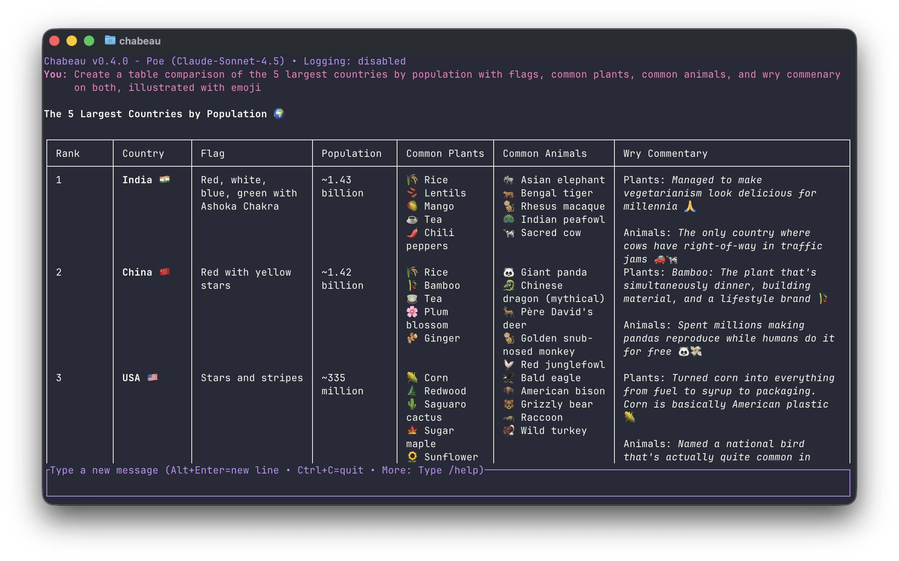

# Chabeau - Terminal Chat Interface



Chabeau is a full-screen terminal chat interface that connects to various AI APIs for real-time conversations. Chabeau brings the convenience of modern chat UIs to the terminal with a focus on speed, ergonomics, and sensible defaults. It is not a coding agent, but preliminary support for the Model Context Protocol is in development. This makes it possible to connect Chabeau with various local and remote services as well.


## Table of Contents
- [Features](#features)
- [Getting Started](#getting-started)
  - [Install](#install)
  - [Authenticate](#authenticate)
  - [Launch](#launch)
- [Working with Providers and Models](#working-with-providers-and-models)
- [Configuration](#configuration)
- [MCP Servers](#mcp-servers)
- [Character Cards](#character-cards)
- [Personas](#personas)
- [Presets](#presets)
- [Appearance and Rendering](#appearance-and-rendering)
- [Keyboard and Workflow Tips](#keyboard-and-workflow-tips)
- [Architecture Overview](#architecture-overview)
- [Development](#development)
- [License](#license)

## Features

### See it in action

- [Message retry](https://permacommons.org/videos/chabeau-0.6.0/retry.mp4)
- [Presets](https://permacommons.org/videos/chabeau-0.6.0/preset-short.mp4)
- [Themes](https://permacommons.org/videos/chabeau-0.6.0/themes.mp4)
- [User message editing](https://permacommons.org/videos/chabeau-0.6.0/user-edit.mp4)
- [Assistant response editing](https://permacommons.org/videos/chabeau-0.6.0/assistant-edit.mp4)
- [Character cards](https://permacommons.org/videos/chabeau-0.6.0/character.mp4)
- [In-place refinement](https://permacommons.org/videos/chabeau-0.6.0/refine.mp4)
- [Syntax highlighting](https://permacommons.org/videos/chabeau-0.6.0/syntax.mp4)
- [Code block selection](https://permacommons.org/videos/chabeau-0.6.0/codeblock.mp4)
- [Complex tables](https://permacommons.org/videos/chabeau-0.6.0/table.mp4)

### Full feature list

- Full-screen terminal UI with real-time streaming responses
- Markdown rendering in the chat area (headings, lists, quotes, tables, callouts, horizontal rules, superscript/subscript, inline/fenced code) with clickable OSC 8 hyperlinks
- Built-in support for many common providers (OpenAI, OpenRouter, Poe, Anthropic, Venice AI, Groq, Mistral, Cerebras)
- Support for quick custom configuration of new OpenAI-compatible providers
- Interactive dialogs for selecting models and providers
- Character card support (v2 format) with in-app picker and defaults per provider/model
- Persona system for defining reusable user identities with variable substitution support
- Reusable preset instructions with picker and CLI toggles for quick context switching
- Extensible theming system that degrades gracefully to terminals with limited color support
- Secure API key storage in system keyring with config-based provider management
- Multi-line input (IME-friendly) with compose mode that can expand to half the terminal for longer responses
- Message retry and message editing
- On-demand refinements of the last assistant response with `/refine <prompt>`
- Slash command registry with inline help for faster command discovery
- Conversation logging with pause/resume; quick `/dump` of contents to a file
- Syntax highlighting for fenced code blocks (Python, Bash, JavaScript, and more)
- Inline block selection (Ctrl+B) to copy or save fenced code blocks
- Assistant message editing (Ctrl+X) to revise or truncate assistant responses without resending, with compose-mode shortcuts available while refining replies
- Prettified API error output with Markdown summaries for easier troubleshooting

For features under consideration, see [WISHLIST.md](WISHLIST.md).

## Getting Started

### Install
```bash
cargo install chabeau
```

### Authenticate
```bash
chabeau auth    # Interactive setup for OpenAI, OpenRouter, Poe, Anthropic, Venice AI, Groq, Mistral, Cerebras, or custom providers
```

### Launch
```bash
chabeau         # Uses defaults; opens pickers when needed
```

Inside the TUI, use `/provider` and `/model` to switch, and `/help` to see a full breakdown of commands and keyboard shortcuts.

## Working with Providers and Models

```bash
chabeau                              # Start chat with defaults (pickers on demand)
chabeau --provider openai            # Use specific provider
chabeau --model gpt-5                # Use specific model
chabeau --log conversation.log       # Enable logging immediately on startup
```

Discover available options:

```bash
chabeau -p                           # List providers and auth status
chabeau -m                           # List available models
chabeau -p openrouter -m             # List models for specific provider
```

Manage authentication from the CLI:

```bash
chabeau auth                         # Set up authentication
chabeau deauth                       # Remove authentication (interactive)
chabeau deauth --provider openai     # Remove specific provider
```

Environment variables are used only if no providers are configured, or when you pass `--env`.

```bash
export OPENAI_API_KEY="your-api-key-here"
export OPENAI_BASE_URL="https://api.openai.com/v1"  # Optional
chabeau --env     # Force using env vars even if providers are configured
```

### Quick, Single-Turn Chats

For quick, one-off questions without launching the full TUI, use the `say` command:

```bash
chabeau say "What is the capital of France?"
```

This command sends a single-turn message to the configured model, streams the response directly to your terminal, and exits. It respects your markdown settings, emits OSC8 hyperlinks when your terminal supports them, and uses a monochrome theme for clean, readable output.

When you omit the prompt argument, `chabeau say` will read from piped or redirected stdin (trimming trailing whitespace) before showing the usage message, so `cat prompt.txt | chabeau say` works as expected.

When stdout is redirected to a file or piped into another program, Chabeau automatically falls back to a plain-text streaming mode. This mode skips OSC8 hyperlinks and cursor control so captured output stays free of escape codes.

If you have multiple providers configured but no default set, Chabeau will prompt you to specify a provider with the `-p` flag. The `-p` and other global flags can be placed before or after the prompt.

Environment variable values can make their way into shell histories or other places they shouldn't, so using the keyring is generally advisable.

## Configuration

Chabeau stores its configuration in `config.toml`.

- Linux: `~/.config/chabeau/config.toml`
- macOS: `~/Library/Application Support/org.permacommons.chabeau/config.toml`

Generally, you can rely on the UI: when you use interactive commands like `/model`, `/provider`, `/theme`, or `/character`, press Alt+Enter (or Ctrl+J) to persist the selection.

Command-line helpers mirror those flows:

```bash
# Set default provider
chabeau set default-provider openai

# Set default model for a provider
chabeau set default-model openai gpt-4o

# Persist a theme
chabeau set theme dark

# Set default character (per provider and model)
chabeau set default-character openai gpt-4 hypatia

# Print the current configuration
chabeau set
```

Both the CLI and TUI run these mutations through the same configuration orchestrator. Chabeau caches the parsed file based on its last-modified timestamp, skipping redundant reloads when nothing has changed, and persists updates atomically so a failed write never clobbers your existing `config.toml`.

Prefer editing by hand? Copy [examples/config.toml.sample](examples/config.toml.sample) to your config directory and adjust it to suit your setup. The sample covers provider defaults, markdown/syntax toggles, custom providers, custom themes, and character assignments.

## MCP Servers

Chabeau can track MCP servers over HTTP (streamable HTTP or SSE) or stdio and surface them in the TUI.

- Configure MCP servers with `[[mcp_servers]]` entries (see `examples/config.toml.sample`).
- Pick a `transport` of `streamable-http`, `sse`, or `stdio`. HTTP transports require `base_url`; stdio transports require `command` and optional `args`/`env`.
- Use `/mcp` to list configured servers; `/mcp <server-id>` connects on demand and fetches tools, resources, templates, and prompts.
- Store bearer tokens with `chabeau mcp token <server>` (tokens are saved in the system keyring under the server id) for HTTP transports; stdio transports read auth from their environment.
- For transport debugging, run `chabeau --debug-mcp` to enable verbose MCP logs on stderr.
- To suppress MCP for a run even when configured, pass `--disable-mcp` (or `-d`).
- For HTTP transports, MCP token storage uses the system keyring keyed by server id. Chabeau warms tool listings in the background and may pause the first send until tools are ready. When MCP tool listings are cached, Chabeau includes tool schemas in chat requests and adds a short MCP tool-use preamble to the system prompt; when models request tools, Chabeau prompts for permission in the input area (Allow once / Allow for session / Deny / Block). Press `I` to inspect the full tool arguments, and the transcript shows a brief waiting note until a decision is made. Approved tools run immediately and their calls render in the transcript, while results appear as short status summaries; press Ctrl+O to inspect the latest tool result (use ←/→ to cycle), including full MCP error details when a call fails.
- When MCP resources or templates are cached, Chabeau injects them into the system prompt and exposes a `mcp_read_resource` tool so models can fetch resource URIs.
- Invoke MCP prompt templates with `/<server-id>:<prompt-id>` (e.g. `/agpedia:article-outline topic="soil health"`). If required arguments are missing, Chabeau will prompt for them in the input area before fetching the prompt and continuing the conversation.

## Character Cards

Chabeau supports character cards in the v2 format, letting you chat with AI personas that define tone, background, and greeting. Cards can be JSON or PNG files (with embedded metadata).

### Import and Manage Cards
```bash
chabeau import path/to/character.json       # Import JSON card
chabeau import path/to/character.png        # Import PNG with embedded metadata
chabeau import character.json --force       # Overwrite existing card
```

Cards are stored in the Chabeau configuration directory. Use `chabeau -c` to print the directory name and any cards Chabeau discovers.

### Use Characters in Chat
```bash
chabeau -c hypatia                          # Start with character by name
chabeau -c hypatia.json                     # Start with character by filename
```

In the TUI, `/character` opens the character picker (↑↓ to navigate, Ctrl+O to inspect full definitions, Enter to select, Alt+Enter to set as default). You can also run `/character <name>` for quick switches.

### Defaults and Directories

Set defaults for provider/model combinations via Alt+Enter (or Ctrl+J) in the picker, or on the CLI:

```bash
chabeau set default-character openai gpt-4 hypatia
chabeau unset default-character openai gpt-4
```

To use a separate cards directory, set the `CHABEAU_CARDS_DIR` environment variable before launching Chabeau.

Example cards live in [examples/hypatia.json](examples/hypatia.json) and [examples/darwin.json](examples/darwin.json).

### Troubleshooting

- "Character not found": ensure the card is in `~/.config/chabeau/cards/` (or its equivalent on macOS or Windows) or provide the full path.
- "Invalid card format": verify the JSON structure matches the v2 spec with required fields (name, description, personality, scenario, first_mes, mes_example).
- "PNG missing metadata": PNG files must contain a `chara` tEXt chunk with base64-encoded JSON.
- Cards not appearing in picker: check file permissions and ensure files have `.json` or `.png` extensions.

### Format Reference

Character cards follow the [v2 specification](https://github.com/malfoyslastname/character-card-spec-v2).

## Personas

Personas allow you to define different user identities for conversations, each with their own name and optional biographical context. Unlike character cards (which define AI personas), personas define who *you* are in the conversation.

### Configure Personas

Add personas to your `config.toml`:

```toml
[[personas]]
id = "developer"
name = "Alex"
bio = "You are talking to Alex, a senior software developer with expertise in Rust and distributed systems."

[[personas]]
id = "student"
name = "Sam"
bio = "Sam is a computer science student learning about AI and machine learning."

[[personas]]
id = "casual"
name = "Jordan"
# bio is optional - persona will just change the display name
```

### Use Personas in Chat

```bash
chabeau --persona developer                 # Start with a specific persona
```

In the TUI, `/persona` opens the persona picker (↑↓ to navigate, Ctrl+O to read the persona text, Enter to select). You can also run `/persona <id>` for quick switches, or select "[Turn off persona]" to return to anonymous mode.

When a persona is active:
- Your messages are labeled with the persona's name instead of "You"
- The persona's bio (if provided) is prepended to the system prompt

### Variable Substitutions

Both personas and character cards support `{{user}}` and `{{char}}` variable substitutions:

- `{{user}}` is replaced with the active persona's display name (or "Anon" if no persona is active)
- `{{char}}` is replaced with the character's name (or "Assistant" if no character is active)

### Persona vs Character Integration

Personas and character cards work together seamlessly:
- **Character cards** define the AI's personality, background, and behavior
- **Personas** define your identity and context in the conversation
- Both support `{{user}}` and `{{char}}` variable substitutions
- The persona's bio is added to the system prompt before the character's instructions

## Presets

Presets let you inject reusable system instructions into the first and last system messages that Chabeau sends to the model. They are ideal for lightweight tone or formatting tweaks that you want to toggle quickly.

Chabeau ships with three built-in presets (`short`, `roleplay`, and `casual`) so you can experiment without editing your config. Set `builtin_presets = false` in `config.toml` to hide them from `/preset`, `/preset <id>`, and the `--preset` flag. If you define a preset with the same ID, your version overrides the built-in automatically.

### Configure Presets

Add presets to your `config.toml`:

```toml
[[presets]]
id = "focus"
pre = """
You are collaborating with {{user}}. Keep responses focused and direct.
"""
post = """
Before finishing, list any follow-up actions.
"""

[[presets]]
id = "roleplay"
pre = """
- Engage in roleplay with the user.
- Two paragraphs per turn max.
- Don't be shy to perform actions. Format these in italics, like this: *{{char}} frowns at {{user}}.*
- Be creative! Feel free to take the roleplay into new directions.
"""
```

- `pre` text is wrapped in blank lines and prepended to the very first system message.
- `post` text is wrapped in blank lines and appended to the final system message. If no system message exists at either position, Chabeau creates one automatically.
- Presets support the same `{{user}}` and `{{char}}` substitutions as personas and character cards.

Assign defaults per provider/model with `default-presets`:

```toml
[default-presets.openai]
"gpt-4o" = "focus"
```

### Use Presets in Chat

Launch with an ID like `--preset focus`, or pick interactively with `/preset`. Use Ctrl+O in the picker to review the preset instructions. The picker includes a "Turn off preset" option to clear the active preset.

The status bar shows the current preset when one is active so you can confirm the context you're using at a glance.

## Appearance and Rendering

### Themes

Chabeau ships with built-in themes and supports custom ones. Use `/theme` in the TUI to preview and Alt+Enter (or Ctrl+J) to persist the choice. On the CLI, run:

```bash
chabeau set theme dark   # Set a theme
chabeau themes           # List themes (built-in and custom)
chabeau unset theme      # Revert to default detection
```

When no explicit theme is set, Chabeau tries to infer a sensible default from your OS preference (e.g., macOS, Windows, GNOME). If no hint is available, it defaults to the dark theme.

Custom themes belong in `config.toml` under `[[custom_themes]]`. See [src/builtins/themes.toml](src/builtins/themes.toml) for color references and [examples/config.toml.sample](examples/config.toml.sample) for structure.

Themes can also set a `cursor_color` to change the terminal cursor via OSC 12 when the theme is applied.

Input uses a steady bar cursor inside the chat box so the insertion point stays easy to see while typing.

App messages—Chabeau’s own informational banners, warnings, and errors—use dedicated theme knobs so they’re easy to distinguish from assistant replies. Customize them with the `app_info_*`, `app_warning_*`, and `app_error_*` keys in your theme to control the prefix text, prefix styling, and message styling independently.

### Markdown and Syntax Highlighting

Toggle these features at runtime:

- `/markdown on|off|toggle`
- `/syntax on|off|toggle`

 Chabeau persists these preferences to the config file automatically. Syntax colors adapt to the active theme and use the theme’s code block background for consistent contrast.

When markdown is enabled, image ALT text is rendered as an OSC hyperlink pointing to the underlying image URL so you can open assets directly from the transcript.

### Color Support

Chabeau detects terminal color depth and adapts themes accordingly:

- Truecolor: if `COLORTERM` contains `truecolor` or `24bit`, Chabeau uses 24-bit RGB.
- 256 colors: if `TERM` contains `256color`, RGB colors are quantized to the xterm-256 palette.
- ANSI 16: otherwise, colors map to the nearest 16 ANSI colors.

Force a mode when needed with `CHABEAU_COLOR=truecolor|256|16`.

## Keyboard and Workflow Tips

### Interface Controls

See [the built-in help](src/builtins/help.md) for a full list of keyboard controls. A few highlights:

- Alt+Enter (or Ctrl+J) to start a new line; Enter sends. Arrow keys always act on the focused area.
- Compose mode (F4) flips the newline/send defaults; focus behavior stays the same.
- Home/End and Ctrl+A/Ctrl+E jump to the start or end of the visible line in the focused pane, even when text is soft-wrapped.
- PgUp/PgDn scroll the focused area — the transcript or the multi-line input — by a page at a time.
- Ctrl+N repeats your most recent `/refine` prompt on the latest assistant reply.
- Tab switches focus between the transcript and input unless the current input starts with `/`. When it does, Tab autocompletes slash commands. The active region shows a `›`; the inactive one shows a `·`.
- Ctrl+O opens the inspect view for picker items—providers include their ID, base URL, and auth mode; themes show their ID and every color override; character cards expand to the full v2 definition.
- Ctrl+D on an empty input prints the transcript and exits; Ctrl+C exits immediately.

### Mousewheel

Chabeau avoids capturing the mouse so selection operations (copy/paste) work as expected. Some terminals treat mousewheel events as cursor key input, so scrolling moves the conversation. Others reveal terminal history; in that case, use the cursor keys or PgUp/PgDn instead.

### External Editor

Set the `EDITOR` environment variable to compose longer responses in your favorite editor:

```bash
export EDITOR=nano          # or vim, code, etc.
export EDITOR="code --wait" # VS Code with wait
```

Once set, press Ctrl+T in the TUI to launch the external editor.

## Architecture Overview

See [ARCHITECTURE.md](ARCHITECTURE.md) for a high-level walkthrough aligned with commit 5d81609a33ce1abeef3ccb976b5387c474221511.

Chabeau uses a modular design with focused components:

- `main.rs` – Entry point
- `api/` – API data structures and model-related helpers
  - `mod.rs` – API data structures
  - `models.rs` – Model fetching and sorting functionality
- `auth/` – Authentication and provider management
  - `mod.rs` – Authentication manager implementation
  - `ui.rs` – Interactive prompts and input helpers for auth flows
- `builtins/` – Build-time assets embedded into the binary
  - `help.md` – In-app keyboard shortcut and command reference
  - `models.toml` – Supported provider definitions
  - `presets.toml` – Built-in system instruction presets
  - `themes.toml` – Built-in UI themes
- `character/` – Character card support (v2 format)
  - `cache.rs` – In-memory caching with invalidation
  - `card.rs` – Character card data structures and v2 spec parsing
  - `import.rs` – Import command and validation logic
  - `loader.rs` – Card file loading (JSON and PNG with metadata extraction)
  - `mod.rs` – Module exports and public API
  - `png_text.rs` – PNG tEXt chunk reader/writer
  - `service.rs` – Shared character cache and resolution helpers for the TUI and CLI
- `cli/` – Command-line interface parsing and handling
  - `character_list.rs` – Character card listing functionality
  - `mod.rs` – CLI argument parsing and command dispatching
  - `model_list.rs` – Model listing functionality
  - `provider_list.rs` – Provider listing functionality
  - `theme_list.rs` – Theme listing functionality
- `commands/` – Chat command processing and registry-driven dispatch
  - `mod.rs` – Command handlers and dispatcher
  - `refine.rs` – Message refinement logic
  - `registry.rs` – Static command metadata registry
- `core/` – Core application components
  - `app/` – Application state and controllers
    - `actions/` – Internal action definitions and dispatcher for chat loop updates
    - `app.rs` – Main `App` struct and event loop integration
    - `conversation.rs` – Conversation controller for chat flow, retries, and streaming helpers
    - `mod.rs` – App struct and module exports
    - `picker/` – Generic picker that powers all TUI selection dialogs
    - `pickers.rs` – Picker constructors and helpers for each picker type
    - `session.rs` – Session bootstrap and provider/model state
    - `settings.rs` – Theme and provider controllers
    - `streaming.rs` – Handles streaming responses from the API
    - `ui_helpers.rs` – UI state transition helpers
    - `ui_state.rs` – UI state management and text input helpers
    - `builtin_presets.rs` – Built-in preset loader
  - `builtin_providers.rs` – Built-in provider configuration (loads from `builtins/models.toml`)
  - `chat_stream.rs` – Shared streaming service that feeds responses to the app, UI, and loggers
  - `config/` – Configuration data, defaults, caching, and persistence
    - `data.rs` – Configuration data types and pure helpers
    - `defaults.rs` – Default selection helpers and `Config` implementations
    - `io.rs` – Config path resolution and persistence routines
    - `mod.rs` – Public exports for configuration helpers
    - `orchestrator.rs` – Cached config loader and mutation orchestrator
    - `printing.rs` – CLI-facing config print helpers
    - `tests.rs` – Configuration module tests
  - `keyring.rs` – Secure storage for API keys
  - `message.rs` – Message data structures
  - `persona.rs` – Persona management and variable substitution
  - `preset.rs` – System instruction preset management
  - `text_wrapping.rs` – Text wrapping utilities
- `ui/` – Terminal interface rendering
  - `appearance.rs` – Theme and style definitions
  - `chat_loop/` – Mode-aware chat loop orchestrating UI flows, keybindings, and command routing
    - `event_loop.rs` – Async terminal loop orchestration, event polling, and stream dispatch
    - `keybindings/` – Mode-aware keybinding registry and handlers
    - `lifecycle.rs` – Terminal setup/teardown helpers and resource guards
    - `modes.rs` – Mode-aware key handlers and text interaction utilities
  - `help.rs` – Help text rendering
  - `layout.rs` – Shared width-aware layout engine for Markdown and plain text
  - `markdown/` – Markdown renderer and wrapping helpers that emit span metadata
  - `mod.rs` – UI module declarations
  - `osc/` – Crossterm backend wrapper that emits OSC 8 hyperlinks
  - `picker.rs` – Picker controls and rendering
  - `renderer.rs` – Terminal interface rendering (chat area, input, pickers)
  - `span.rs` – Span metadata for clickable links
  - `theme.rs` – Theme loading and management
  - `title.rs` – Header bar rendering
- `utils/` – Utility functions and helpers
  - `clipboard.rs` – Cross-platform clipboard helper
  - `color.rs` – Terminal color detection and palette quantization
  - `editor.rs` – External editor integration
  - `logging.rs` – Chat logging functionality
  - `mod.rs` – Utility module declarations
  - `scroll.rs` – Text wrapping and scroll calculations

## Development

### Running Tests
```bash
cargo test                    # All tests
cargo test scroll::           # Scroll functionality tests
cargo test --release          # Faster execution
```

### Performance

Chabeau includes lightweight performance checks in the unit test suite and supports optional Criterion benches.

- Built-in perf checks (unit tests):
  - Short history prewrap (50 iters, ~60 lines): warns at ≥ 90ms; fails at ≥ 200ms.
  - Large history prewrap (20 iters, ~400 lines): warns at ≥ 400ms; fails at ≥ 1000ms.
  - Run with: `cargo test` (warnings print to stderr; tests only fail past the fail thresholds).
- Optional benches (release mode) using Criterion 0.7:
  - A `render_cache` bench validates the cached prewrapped rendering path.
  - Run: `cargo bench`
  - Reports live in `target/criterion/` (HTML under `report/index.html`).
  - To add new benches, create files under `benches/` (e.g., `benches/my_bench.rs`) and use Criterion’s `criterion_group!/criterion_main!`.
  - Benches import internal modules via `src/lib.rs` (e.g., `use chabeau::...`).

## License

CC0 1.0 Universal (Public Domain)
